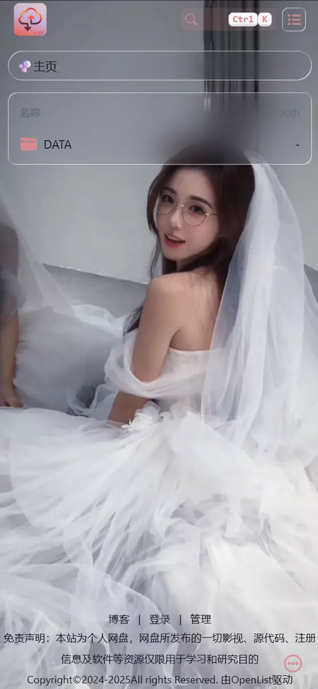
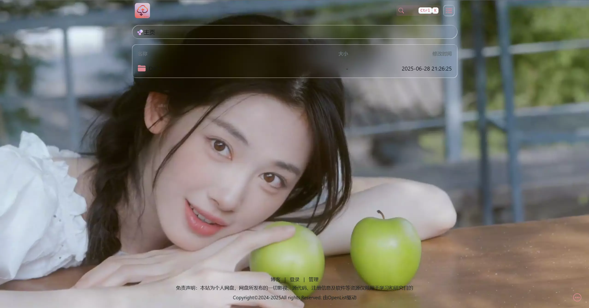

# OpenList/AList 玻璃拟态主题

为 OpenList/AList 项目设计的现代化玻璃拟态主题，提供优雅的视觉效果和流畅的用户体验。

## 主题特点

- **玻璃拟态效果**：所有 UI 元素采用高级玻璃质感设计
- **动态视频背景**：支持响应式视频背景（桌面/移动端自适应）
- **SVG 滤镜特效**：使用高级 SVG 滤镜实现液体玻璃效果
- **暗色模式支持**：完美适配 Hope UI 暗色模式
- **响应式设计**：全面适配桌面和移动设备
- **优雅动画**：平滑过渡和悬停效果

## 安装指南

### 在 OpenList/AList 中使用主题

1. 登录 OpenList/AList 管理后台
2. 进入「设置」->「全局」
3. 将以下内容添加到对应位置（部分代码已进行压缩，若查看格式化代码内容，请浏览 `main.html`和 `style.scss`文件）：

**自定义头部：**

进入「设置」→「外观」→「自定义头部」

```html
<style type="text/css">
body {
  /* 手机端背景图 */
  --mobile-background-image: url(https://pan.wiiuii.cn/p/DATA/BLOG/images/%E5%93%88%E5%A6%AE%E5%85%8B%E5%AD%9C05.jpg);
  /* 电脑端背景图 */
  --desktop-background-image: url(https://pan.wiiuii.cn/p/DATA/BLOG/images/%E5%93%88%E5%A6%AE%E5%85%8B%E5%AD%9C10.jpg);
}
.hope-ui-dark .markdown-body a{color:var(--hope-colors-loContrast) !important}html ::selection{background-color:var(--hope-colors-accent8);color:var(--hope-colors-loContrast)}body{background-image:var(--desktop-background-image) !important;background-repeat:no-repeat !important;background-size:cover !important;background-attachment:fixed !important;background-position-x:center !important}@media screen and (max-width: 960px){body{background-image:var(--mobile-background-image) !important}}.video-container{position:fixed;top:0;left:0;width:100%;height:100%;z-index:-1;overflow:hidden}.video-container video{min-width:100%;min-height:100%;width:auto;height:auto;position:absolute;top:50%;left:50%;transform:translate(-50%, -50%);object-fit:cover}.hope-c-PJLV-idaeksS-css,.hope-c-PJLV-ikaMhsQ-css{background:none !important}.hope-c-PJLV-idaeksS-css{border-radius:var(--hope-radii-full);overflow:hidden;padding:var(--hope-space-1) var(--hope-space-2)}.hope-c-khZXrc{display:inline-block !important}.hope-c-cPYwgm{text-overflow:ellipsis;display:-webkit-box !important;-webkit-line-clamp:1;-webkit-box-orient:vertical;white-space:normal;word-break:break-all}.hope-c-iIOWzi{padding:0 var(--hope-space-1) !important}.hope-c-PJLV-igScBhH-css,.hope-c-hOYTCS,.hope-c-PJLV-idaeksS-css,.hope-c-PJLV-ieTGfmR-css,.hope-c-PJLV-ijMezfq-css,.hope-c-PJLV-ijgzmFG-css,.hope-c-PJLV-ikJQsXT-css,.hope-c-zbPwS,.hope-c-XJURY,.hope-c-ivMHWx-fbcPgu-cv,.hope-c-ivMHWx-dvmlqS-cv,.hope-c-ivMHWx-dMllzy-cv,.hope-c-cFbQhW,.hope-c-ivMHWx-knrFJ-cv,.hope-c-ivMHWx-gHYUvy-cv,.hope-c-PJLV-iigjoxS-css,.solid-contextmenu,.hope-c-PJLV-idusLCn-css,.hope-c-ivMHWx-eHkSxq-cv,.hope-c-kvTTWD-hYRNAb-variant-filled,.hope-c-ivMHWx:disabled,.hope-c-mHASU-byiOue-variant-filled,.hope-c-mHASU-kukbfD-variant-outline,.hope-c-PJLV-ihVEsOa-css,.hope-c-gIqhpo,.hope-c-PJLV-ibcBsNO-css .hope-c-PJLV-iubUra-css,.hope-c-PJLV-ibcBsNO-css .hope-c-PJLV-ifjOQLV-css{background-color:transparent !important;box-shadow:inset 1px 1px 0px 0px rgba(255,255,255,0.5),inset -1px -1px 0px 0px rgba(255,255,255,0.6) !important;cursor:grab;backdrop-filter:url(#liquid-glass-filter) blur(20px) saturate(1.4) !important;pointer-events:auto;border:none !important}.hope-c-PJLV-ijMezfq-css{height:var(--hope-sizes-8);border:none !important;padding:var(--hope-space-1) var(--hope-space-2) !important}.hope-c-PJLV-ijSQbqe-css{background-color:var(--hope-colors-blackAlpha3) !important;border-color:rgba(234,234,234,0.5) !important}.hope-c-PJLV-iciJSBF-css{opacity:0.5}.markdown-body .highlight pre,.markdown-body pre{background-color:var(--hope-colors-blackAlpha3) !important;backdrop-filter:blur(var(--hope-space-3))}.hope-c-gUeVCo[data-active],.hope-c-kRwRnM-gSazcJ-colorScheme-neutral[data-active]{background-color:var(--hope-colors-blackAlpha3) !important}.hope-c-ctSAUo,.hope-c-bICGYT-dWksIc-scrollBehavior-outside{background-color:var(--hope-colors-blackAlpha6) !important;backdrop-filter:blur(8px)}.footer{opacity:0;transition:opacity .3s ease-in-out}.copyright{font-size:14px;text-align:center}.copyright .copyright-links{display:flex;align-items:center;justify-content:center;gap:var(--hope-space-2)}.copyright .copyright-desc{line-height:2}.copyright a{transition:color .3s ease-in-out}.copyright a:hover{color:var(--hope-colors-accent8)}.hope-c-PJLV-ihWgyFw-css,.hope-c-PJLV-ibiABng-css{display:none !important}
</style>
```

**自定义内容：**

进入「设置」→「外观」→「自定义内容」

```html
<!-- 视频背景 -->
<div class="video-container"><video id="bg-video" autoplay muted loop playsinline><source type="video/mp4"></video></div>
<!-- SVG -->
<svg style="display:none"><filter id="liquid-glass-filter" x="0%" y="0%" width="100%" height="100%" filterUnits="objectBoundingBox"><feTurbulence type="fractalNoise" baseFrequency="0.01 0.01" numOctaves="1" seed="5" result="turbulence"></feTurbulence><feComponentTransfer in="turbulence" result="mapped"><feFuncR type="gamma" amplitude="1" exponent="10" offset="0.5"></feFuncR><feFuncG type="gamma" amplitude="0" exponent="1" offset="0"></feFuncG><feFuncB type="gamma" amplitude="0" exponent="1" offset="0.5"></feFuncB></feComponentTransfer><feGaussianBlur in="turbulence" stdDeviation="3" result="softMap"></feGaussianBlur><feSpecularLighting in="softMap" surfaceScale="5" specularConstant="1" specularExponent="100" lighting-color="white" result="specLight"><fePointLight x="-200" y="-200" z="300"></fePointLight></feSpecularLighting><feComposite in="specLight" operator="arithmetic" k1="0" k2="1" k3="1" k4="0" result="litImage"></feComposite><feDisplacementMap in="SourceGraphic" in2="softMap" scale="150" xChannelSelector="R" yChannelSelector="G"></feDisplacementMap></filter></svg>
<!-- 渲染HTML + 动态视频 -->
<script type="text/javascript">
const config = {
  video: {
    mobileSource: "https://pan.wiiuii.cn/d/DATA/BLOG/video/small.mp4",
    desktopSource: "https://pan.wiiuii.cn/d/DATA/BLOG/video/large.mp4",
    elementId: "bg-video",
  },
  footer: {
    selector: ".footer",
    maxAttempts: 10,
    retryInterval: 300,
    blog: "https://www.biibii.cn/",
  },
};
const DeviceType={MOBILE:'mobile',DESKTOP:'desktop'};const debounce=(func,wait=250)=>{let timeout;return function(...args){clearTimeout(timeout);timeout=setTimeout(()=>{func.apply(this,args)},wait)}};class BackgroundVideoManager{constructor(){this.videoElement=document.getElementById(config.video.elementId);this.sourceElement=this.videoElement?.querySelector('source');this.lastSource='';this.lastDeviceType=null}init(){if(!this.videoElement||!this.sourceElement)return;this.switchVideoSource();const debouncedResizeHandler=debounce(()=>this.switchVideoSource());window.addEventListener('resize',debouncedResizeHandler);document.addEventListener('visibilitychange',()=>{if(document.visibilityState==='visible'){this.playVideo().catch(e=>console.log('恢复播放失败:',e))}})}getDeviceType(){return(window.innerWidth<768||window.matchMedia('(pointer: coarse)').matches)?DeviceType.MOBILE:DeviceType.DESKTOP}switchVideoSource(){const deviceType=this.getDeviceType();if(deviceType===this.lastDeviceType)return;this.lastDeviceType=deviceType;const newSource=deviceType===DeviceType.MOBILE?config.video.mobileSource:config.video.desktopSource;if(newSource!==this.lastSource){this.sourceElement.src=newSource;this.lastSource=newSource;this.loadVideo();this.playVideo().catch(error=>{console.log('视频自动播放被阻止:',error)})}}loadVideo(){this.videoElement.load()}playVideo(){return this.videoElement.play()}}class FooterManager{constructor(){this.currentYear=new Date().getFullYear();this.attemptCount=0}init(){if(this.renderFooter())return;const interval=setInterval(()=>{if(this.attemptCount++>=config.footer.maxAttempts){clearInterval(interval);console.warn("Footer element not found after maximum attempts");return}if(this.renderFooter()){clearInterval(interval)}},config.footer.retryInterval)}renderFooter(){const footerElement=document.querySelector(config.footer.selector);if(!footerElement)return false;footerElement.innerHTML=this.getFooterHtml();footerElement.style.opacity="1";return true}getFooterHtml(){return`<div class="copyright"><div class="copyright-links"><a href="${config.footer.blog}"target="_blank">博客</a> | <a href="/@login">登录</a> | <a href="/@manage">管理</a></div><div class="copyright-desc"><p>免责声明：本站为个人网盘，网盘所发布的一切影视、源代码、注册信息及软件等资源仅限用于学习和研究目的</p><p>Copyright©2024-${this.currentYear}All rights Reserved. 由OpenList驱动</p></div></div>`}}const init=()=>{const videoManager=new BackgroundVideoManager();videoManager.init();const footerManager=new FooterManager();footerManager.init()};document.addEventListener("DOMContentLoaded",init);
</script>
```

4. 保存设置并刷新页面查看效果

### 自定义配置

您可以根据需要修改以下配置：

1. 视频源：

   - 修改 `config.video.mobileSource` 和 `config.video.desktopSource` 替换为您的视频链接
2. 背景图片（防止视频失效）：

   - 在 CSS 中修改 `--mobile-background-image` 和 `--desktop-background-image` 变量值
3. 页脚信息：

   - 在 `config.footer.blog` 中修改博客链接
   - 在 `getFooterHtml()` 方法中自定义页脚 HTML

### 效果展示

- 移动设备（小屏）：

  

- 桌面设备（大屏）：

  

### 兼容性

本主题兼容以下环境：

- 现代浏览器（Chrome, Firefox, Edge, Safari）
- OPenList/AList v3 及以上版本
- 桌面和移动设备

### 许可证

本项目采用 MIT 许可证 - 详情请参阅 `LICENSE` 文件

### 问题反馈

如有任何问题或建议，请提交至 `Issues`
